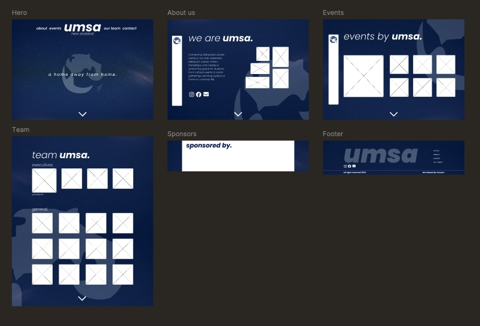

# TODO
- [x] fixed header with blurred background
  - [ ] fixed header with dynamic colour change according to background
- [x] add arrow to bottom of landing page
- [ ] shooting stars
- [x] images across the landing page
  - [x] image carousel (potentially)
- [x] pulsing globe icon
- [ ] responsive design for landing page carousel
- [ ] (*) create custom cms
  - [x] remove prismic implemention
- [ ] (*) parallax scrolling
- [ ] (*) loading screen animation -> rotating globe
- [x] hover effects for all icons
  - [ ] fix: hover:scaling doesnt go past bounds of parent container (landing page)
- [ ] about page
  - [ ] update description (larger + smaller font, 2 separate sections)
  - [x] image 
    - [ ] image carousel (potentially)
  - [x] stretch grid to parent container size
  - [x] format description text
  - [x] globe background
- [ ] events page
  - [x] image carousel
  - [ ] link to "all events" -> "home/events" from "view all"
  - [ ] coming soon events 
  - [ ] links to events
- [ ] teams page
  - [ ] get photos
  - [ ] finish grid layout for teams
  - [ ] globe background
- [ ] faq page
- [ ] sponsor list
- [x] finish footer

# INPROGRESS
- [ ]

## wip

